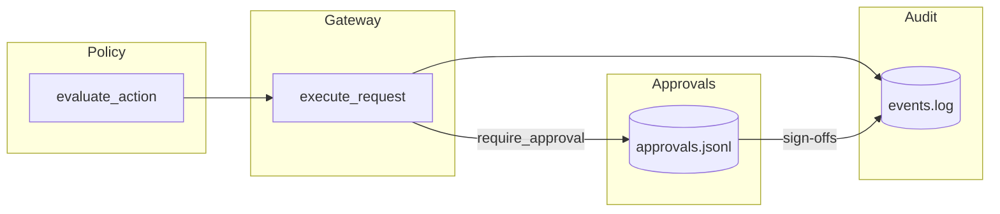

# Approval workflows (Phase 2D)

Phase 2D adds **human-in-the-loop** controls for sensitive agent execution. Approvals are represented as typed records, stored locally in `approval_logs/approvals.jsonl`, and wired into the **runtime execution gateway** so policy decisions that require approval stay **pending** until humans satisfy the configured gates.

This document explains how those controls support financial governance, dual approval, regulated execution, and how they relate to the gateway & audit log.

## Human-in-the-loop controls

When policy matches a `require_approval` rule, the gateway:

1. Computes **deterministic** approval requirements from the matched rules (named approvers and/or minimum distinct human sign-offs).
2. Opens or reuses an **approval row** keyed by a stable `approval_id` derived from the execution fingerprint (`request_id`, `agent_id`, `capability`, `permission_scope`).
3. Returns `pending_approval` until the approval row reaches a terminal allowed state.
4. Emits **audit templates** (`approval.created`, `approval.signoff`, `approval.resolved`) that operators append to the existing chained audit log alongside `gateway.execution` events.

There is **no** web UI, mailer, database, or queue—only local JSONL & deterministic evaluation suitable for tests & regulated pilots.

## Financial governance

Policy rules already express **payment thresholds** via `amount_gt` / `amount_lt` on `RuleConditions`. Pair those predicates with `effect: require_approval` so large transfers or payouts route through explicit approval rows:

- **Named treasury identities** — list identities under `required_approver_ids`; each listed approver must sign once.
- **Open quorum** — omit named lists & set `min_distinct_approvers` to require N **distinct** human identities (dual/triple control).

The `ApprovalRequest` record captures the frozen **requested action** snapshot (`capability`, `permission_scope`, `amount`, `environment`) for forensic comparison against what was actually executed later.

## Dual approval systems

Dual control is modeled as either:

- **Named dual** — `required_approver_ids: [alice, bob]` (both must appear in `approved_by`), or
- **Anonymous dual** — `min_distinct_approvers: 2` with an empty named list so **two different** humans must sign; duplicate identities are rejected.

The engine prevents **duplicate approvals** from the same identity & treats **denied** / **expired** approvals as **terminal**—subsequent gateway passes surface `denied` instead of reopening the workflow automatically.

## Production & restricted environments

Additional predicates help governance packs without embedding business logic in the gateway:

- **`environment`** — tie rules to staging vs production-like environments carried on `ExecutionRequest.environment`.
- **`production_deploy`** — when `RuleConditions.production_deploy` is `true`, the rule matches only if `ActionRequest.metadata.production_deploy` is explicitly `true`, enabling **production deployment approval** paths driven entirely from policy YAML.

Combine these with `require_approval` to force human review before prod deploys or before actions tagged as restricted.

## Regulated execution controls

Regulated workflows typically need:

| Control | Mechanism in this phase |
| --- | --- |
| Evidence of intent | `approval_logs` rows + `audit_logs` hash chain |
| Segregation of duties | Named approvers or distinct-sign-off counts |
| Policy alignment | Matched rule ids copied into approval metadata |
| Expiry | Optional `approval_expires_at` on execution metadata → `expires_at` on the approval row |

Expired pending rows auto-transition to `expired` on the next gateway evaluation (with an `approval.resolved` audit template emitted when operators append audit events).

## Relationship to the runtime gateway

1. **Gateway first** validates registry index + manifest capabilities/scopes (Phase 2C behavior unchanged).
2. **Policy evaluation** decides among allow / deny / require_approval (Phase 2A precedence).
3. **Approval module** persists structured rows & feeds audit templates; **no execution is implicitly allowed** until either policy allows outright **or** an approval row is fully satisfied.

CLI shortcuts (`recklock-registry execute-request`, `recklock-registry create-approval`, `recklock-registry approve-request`, `recklock-registry deny-request`, `recklock-registry list-approvals`) wrap the same library surfaces the tests exercise—making local reviews reproducible without standing up external services.
